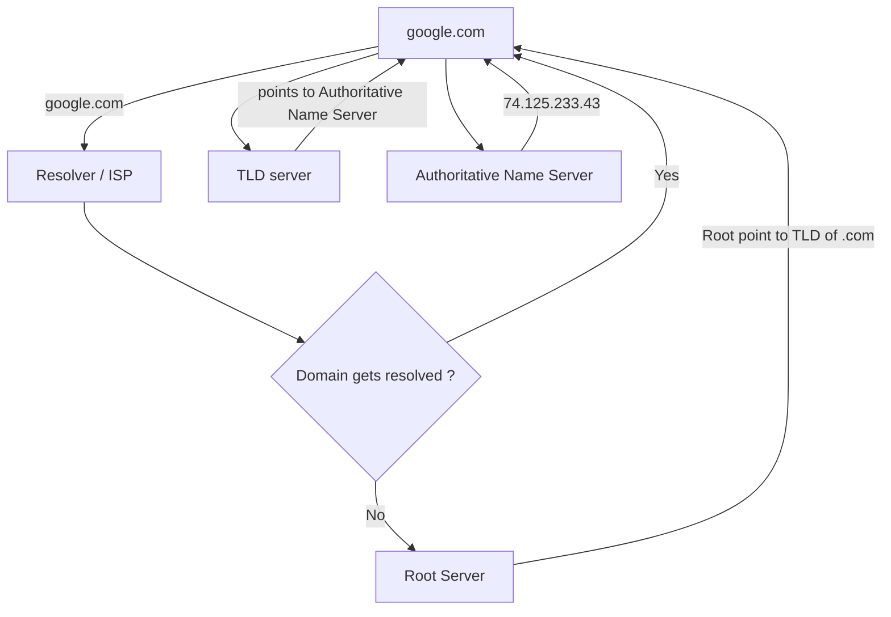

# Domain Name System

- It is like a hashmap of website names to their corresponding IPs. It resolved domain name to its orginal IP.

- www.google.com -> get resolved to something like 74.125.233.43

1.  The first request goes to the ISP , if the domain gets resolved or already cached. It comes back to you.

2.  If domain is not resolved, then the query goes to the ROOT server. There are a total of 13 Root servers placed around the world managed by 12 organizations.

3.  The ROOT server then points the Resolver to the TLD server.
TLD stands for Top Level Domain Server. In our case it points to the TLD of .com domains.

4. When TLD gets the request, it also does not know of the IP of the google.com. So it points to the final server **Authoritative Name Server**.

[DNS Records](./dnsrecords.md)